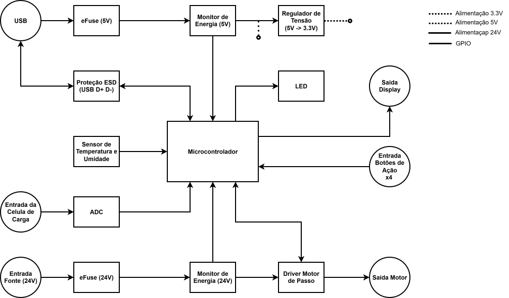
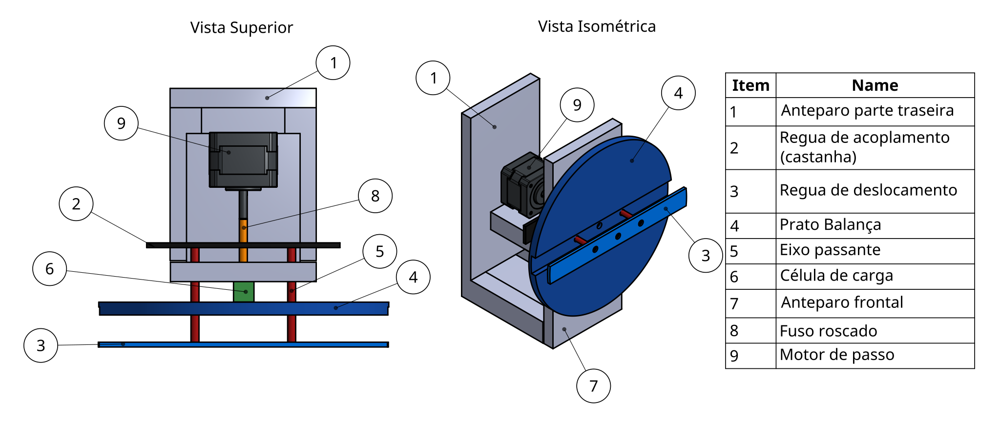
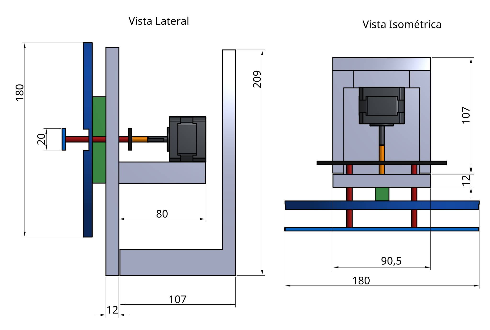
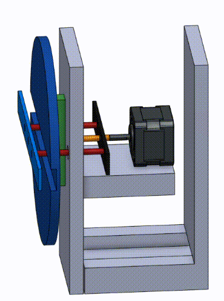

# Etapa 1

Esta etapa define a arquitetura do equipamento inicial, antes da escolha dos componentes. Foram produzidos o diagrama de blocos de hardware e comunicação, a especificação funcional de cada bloco, o esboço da estrutura 3D e o levantamento da norma aplicável. Com a arquitetura fechada e os requisitos definidos, a seleção dos componentes passa a ser feita por critério técnico e, a partir do diagrama criado, serão desenvolvidos os esquemáticos do circuito e diagrama de estados na etapa seguinte.

## Desenvolvimento

### Diagrama de blocos de hardware e comunicação

**Alimentação**

| Bloco | Função |
| :--- | :--- |
| **Entrada de 24 V** | Fonte externa que alimenta a parte de potência do motor. |
| **Proteção da entrada de 24 V** | Alimenta o circuito em condição segura, cortando a energia em caso de falha. |
| **Monitor de energia (24 V)** | Mede tensão, corrente e potência dessa linha. |
| **Entrada USB (5 V)** | Alimenta a eletrônica de sinal e conecta o equipamento ao computador. |
| **Proteção da entrada de 5 V** | Mesma função, aplicada à linha de 5 V. |
| **Monitor de energia (5 V)** | Mede o consumo da linha de 5 V. |
| **Regulador de tensão** | Reduz os 5 V para os 3,3 V usados pela parte digital. |

**Controle e medição**

| Bloco | Função |
| :--- | :--- |
| **Microcontrolador** | Centro do sistema: lê os sensores, comanda o motor, atualiza o display e troca dados com o computador. |
| **Proteção ESD da USB** | Desvia as descargas eletrostáticas do cabo antes que alcancem o microcontrolador. |
| **Entrada da célula de carga** | Recebe o sinal de peso do sensor externo. |
| **Conversor A/D** | Amplifica e digitaliza o sinal da célula de carga. |
| **Sensor de temperatura e umidade** | Mede as condições do ambiente de operação. |

**Acionamento e interface**

| Bloco | Função |
| :--- | :--- |
| **Driver do motor de passo** | Converte os comandos do microcontrolador em corrente nas bobinas do motor. |
| **Saída para o motor** | Conexão do motor de passo ao equipamento. |
| **Botões de ação (4)** | Entrada dos comandos do operador. |
| **LED indicador** | Sinaliza o estado de funcionamento. |
| **Saída para o display** | Apresenta as informações ao operador. |

### Especificação dos componentes de hardware

Os componentes ainda não foram definidos, esta seção estabelece o que cada bloco precisa atender. O sistema é alimentado por 24 V (potência do motor) e por 5 V da porta USB, que é também o canal de comunicação com o software de PC que opera o equipamento. 

Toda a parte digital opera em 3,3 V. A comunicação entre os blocos será digital, em 3,3 V, com preferência por periféricos que compartilhem o mesmo barramento para economizar pinos. As interfaces serão definidas junto com a escolha dos componentes.

| Bloco | O que precisa atender |
| :--- | :--- |
| **Proteção das entradas (2)** | Desligar por subtensão ou sobretensão, limitar a corrente, partida suave e sinalizar falha. A de 24 V suporta corrente maior; a de 5 V respeita o limite de uma porta USB. |
| **Regulador 5 V → 3,3 V** | Corrente para toda a parte digital e baixo ruído, pois a mesma tensão alimenta o circuito de pesagem. |
| **Monitores de energia (2)** | Medir tensão, corrente e potência das linhas de 5 V e 24 V. |
| **Microcontrolador** | Pinos para todos os blocos; sinais em 3,3 V; comunicação USB para gravação e para o software do computador; pulsos com temporização precisa. |
| **Conversor A/D** | Sinal diferencial de poucos milivolts: amplificar, converter com alta resolução, filtrar a interferência da rede e manter a leitura estável. |
| **Sensor de temperatura e umidade** | Saída digital já calibrada, ±1 °C e ±3 % de umidade, alimentação em 3,3 V. |
| **Driver do motor de passo** | Motor bipolar NEMA 17 em 24 V; passo, direção e habilitação; micropassos; desligado por padrão ao energizar; proteção térmica e de sobrecorrente. |
| **Botões (4)** | Comandos do operador e durabilidade para uso frequente. |
| **LED indicador** | Estado do equipamento em mais de uma cor, com o mínimo de pinos. |
| **Conector do display** | Display externo, ligado por cabo; conector polarizado e com travamento. |
| **Proteção da porta USB** | Desviar as descargas eletrostáticas sem degradar o sinal. |
| **Conectores externos** | Folga de corrente no 24 V e no motor; boa fixação do USB; conectores distintos entre si. |

### Esboço da estrutura 3D

### Norma aplicável

Este projeto foi desenvolvido para atender aos requisitos da norma **BS EN 13819-1:2020 (Hearing protectors - Testing - Part 1: Physical test methods)**. Esta norma europeia estabelece os métodos de ensaios físicos que devem ser aplicados para avaliar o desempenho de protetores auditivos, garantindo que cumpram as especificações de segurança.

#### Requisitos Mecânicos

*   **Dispositivo de Teste ([Seção 4.2.2.1](https://github.com/user-attachments/files/32043709/EN.13819-1-2020.1.pdf)):** A norma exige a utilização de uma estrutura com um transdutor de força para medir eletronicamente a carga exercida pelos abafadores.

* **Controle Dimensional ([Seção 4.4.3](https://github.com/user-attachments/files/32043709/EN.13819-1-2020.1.pdf)):** O sistema deve garantir que as duas placas de suporte se mantenham estritamente paralelas durante o teste. A separação das superfícies externas dessas placas deve ser ajustável para corresponder a larguras de teste padronizadas, sendo 135 mm _(Tamanho P)_, 145 mm _(Tamanho M)_ e 150 mm _(Tamanho G)_.
* **Alinhamento do Centro de Medição ([Seções 4.4.2.2 e 4.4.3.2.3](https://github.com/user-attachments/files/32043709/EN.13819-1-2020.1.pdf)):** A estrutura mecânica deve garantir que as aberturas das almofadas sejam posicionadas de modo que seus centros coincidam exatamente com o eixo horizontal que passa pelo centro do transdutor de força.
* **Ajuste de Altura ([Tabela 4 e Seção 4.4.3.2.3](https://github.com/user-attachments/files/32043709/EN.13819-1-2020.1.pdf)):** A mecânica da bancada deve permitir o ajuste da altura do suporte do arco _(distância vertical em relação ao centro das conchas)_. Para abafadores usados sobre a cabeça, as alturas normatizadas são 122 mm _(Tamanho P)_, 130 mm _(Tamanho M)_ e 135 mm _(Tamanho G)_.

#### Temporização e Monitoramento

* **Janela de Leitura Crítica ([Seção 4.4.3.2.4](https://github.com/user-attachments/files/32043709/EN.13819-1-2020.1.pdf)):** A norma determina que a medição oficial da força do arco deve ser lida no indicador exata e automaticamente em 120 ± 5 segundos após a liberação do protetor no suporte.
* **Condições de Contorno ([Seção 4.1.2](https://github.com/user-attachments/files/32043709/EN.13819-1-2020.1.pdf)):** A norma estipula atmosferas específicas de condicionamento e teste, exigindo uma temperatura de 22 ± 5 °C e uma umidade relativa não superior a 85%.
* **Período de Descanso entre Ensaios ([Seção 4.4.3.2.5](https://github.com/user-attachments/files/32043709/EN.13819-1-2020.1.pdf)):** Quando um mesmo protetor auditivo for submetido a testes sequenciais em diferentes larguras e alturas, o sistema deve respeitar um período mínimo de descanso de 4 horas antes da próxima medição.

## Referências

Norma **EN 13819-1-2020** 1 via _BSI Standards Publication_: [EN 13819-1-2020 1.pdf](https://github.com/user-attachments/files/32043709/EN.13819-1-2020.1.pdf)
