# Etapa 2

Com a arquitetura e os requisitos definidos na etapa anterior, esta etapa escolhe os componentes e detalha o projeto eletrônico. Para cada bloco foram levantadas alternativas comerciais e comparadas contra os requisitos da Etapa 1. Em seguida foram desenvolvidos os diagramas de estados do firmware e do software, os esquemáticos de comunicação e de alimentação, e o modelo 3D da estrutura de ensaio.

## Desenvolvimento

### Definição dos componentes

| Bloco | Alternativas | Escolhido |
| :--- | :--- | :--- |
| Microcontrolador | STM32F411 · RP2040 · ESP32-S3 | ESP32-S3-WROOM-1-N8 |
| Conversor A/D | HX711 · NAU7802 · ADS1232 | ADS1232IPW |
| Driver do motor | A4988 · DRV8825 · TMC2209 | TMC2209-LA |
| Monitor de energia | INA219 · INA228 · INA226 | INA226 (×2) |
| Sensor ambiental | DHT22 · SHT31 · BME280 | BME280 |
| Regulador 3,3 V | AMS1117 · TPS7A91 | TPS7A91 |
| Proteção 24 V | Fusível+TVS · LM5069 · TPS26630 | TPS26630RGER |
| Proteção 5 V | Polyfuse · TPS2553 · TPS25210 | TPS25210ARPWR |
| Proteção ESD USB | Discretos · PRTR5V0U2X · USBLC6 | USBLC6-2SC6 |
| LED indicador | RGB discreto · APA102 · WS2812D | WS2812D |

As quatro decisões de maior impacto no ensaio:

**Microcontrolador.** Os dois núcleos com FreeRTOS separam a malha de tempo crítico da comunicação: a cronometragem dos 120 s e os pulsos do motor não competem com a pilha USB.

**Conversor A/D.** O HX711 é mais barato, mas sua referência vem do regulador interno, o que dificulta a medição raciométrica. O NAU7802 usa I2C, e colocaria o sinal mais sensível no barramento compartilhado.

**Sensor ambiental.** Existe para verificar as condições que a norma exige (22 ± 5 °C e até 85 % de umidade). O BME280 atende a faixa com margem.

**Driver do motor.** Como a leitura acontece 120 s após a liberação da concha, trancos no movimento perturbariam a medida; a interpolação do TMC2209 suaviza partida e parada.

**Trade-offs assumidos.** O SHT31 é mais exato que o BME280 em umidade (±2 % contra ±3 %) e o PRTR5V0U2X tem capacitância menor que o USBLC6-2SC6. Ambos foram preteridos por custo e disponibilidade, já atendendo o requisito.

### Diagrama de estados do firmware e do software

O firmware atende um comando por vez a partir de OCIOSO, executa, responde ao computador e volta a esperar. Na partida ele verifica os periféricos antes de aceitar qualquer comando de ensaio.

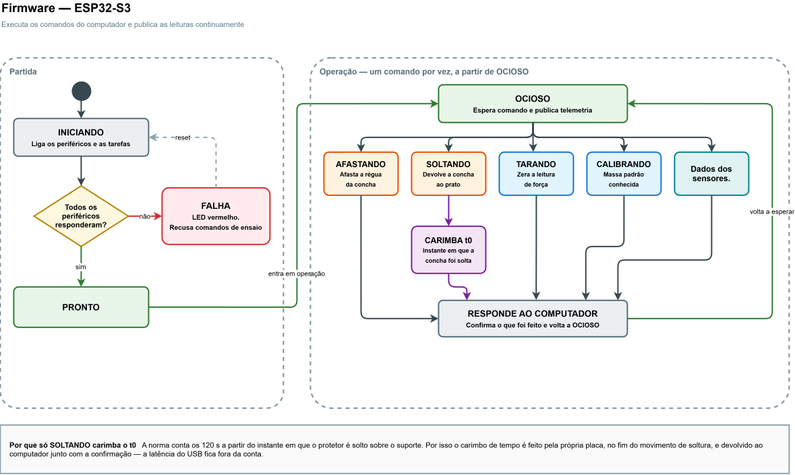

O software conduz o ensaio: prepara, repete o ciclo de medição e encerra exportando o arquivo. Dois estados vêm da norma, o ajuste de largura e altura da bancada, e o descanso de 4 h antes de repetir o mesmo protetor em outra configuração.

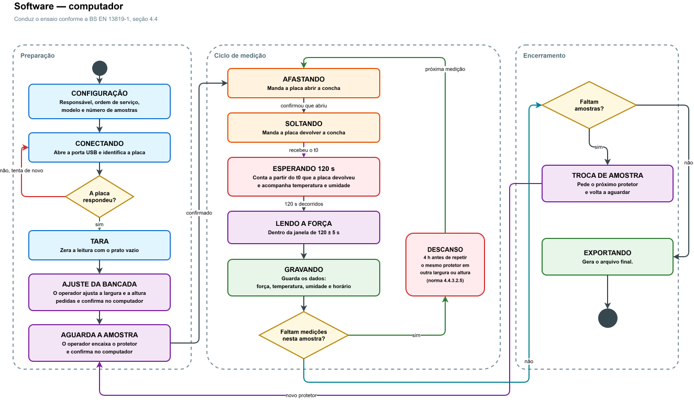

**Decisão de projeto:** quem carimba o instante da liberação (t0) é a placa, com o próprio relógio, devolvendo o valor na confirmação. O computador conta os 120 s a partir desse valor, o que tira o atraso variável do USB da conta, relevante porque a janela da norma é de apenas ±5 s.

### Esquemático do circuito de comunicação

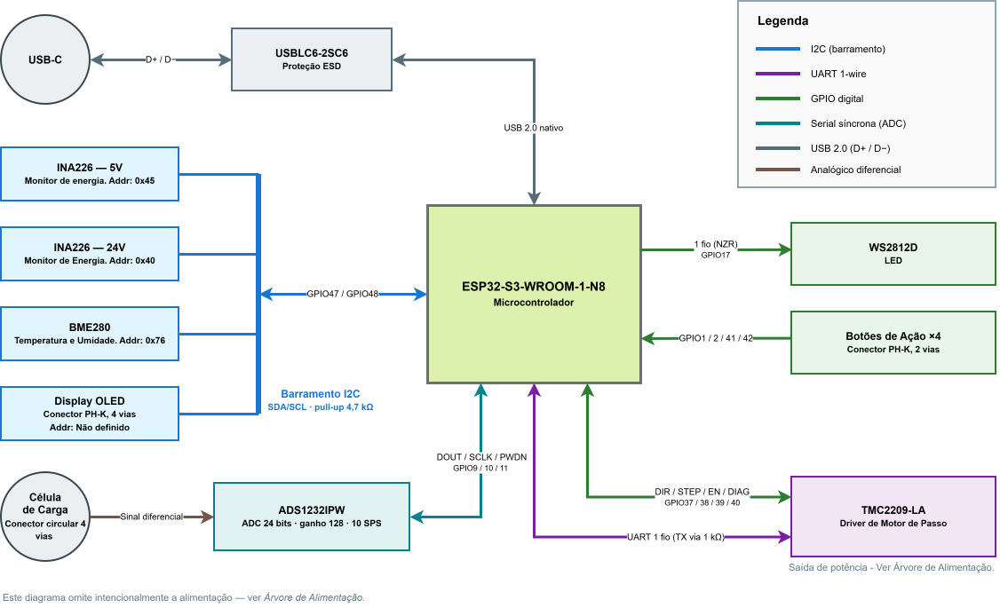

Quatro dispositivos dividem o barramento I2C usando dois pinos: os dois monitores de energia, o sensor ambiental e o display. O driver do motor usa UART de fio único. O conversor A/D ficou fora do barramento compartilhado, com interface dedicada, por ser o sinal mais sensível a ruído.

### Esquemático do circuito de alimentação

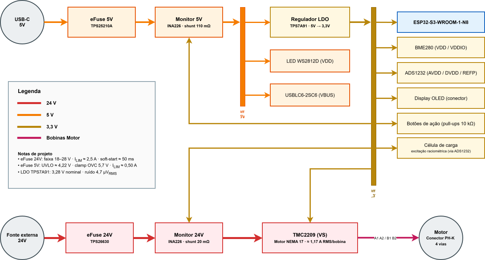

As duas entradas são protegidas e monitoradas antes de alimentar o restante da placa. A malha de 3,3 V alimenta a parte digital e serve de excitação da célula de carga, o que justifica o requisito de ruído baixo definido na Etapa 1.

### Esquemático no KiCad

**ESP32-S3-WROOM-1 — Microcontrolador.** Lê os sensores, comanda o motor e troca dados com o computador.

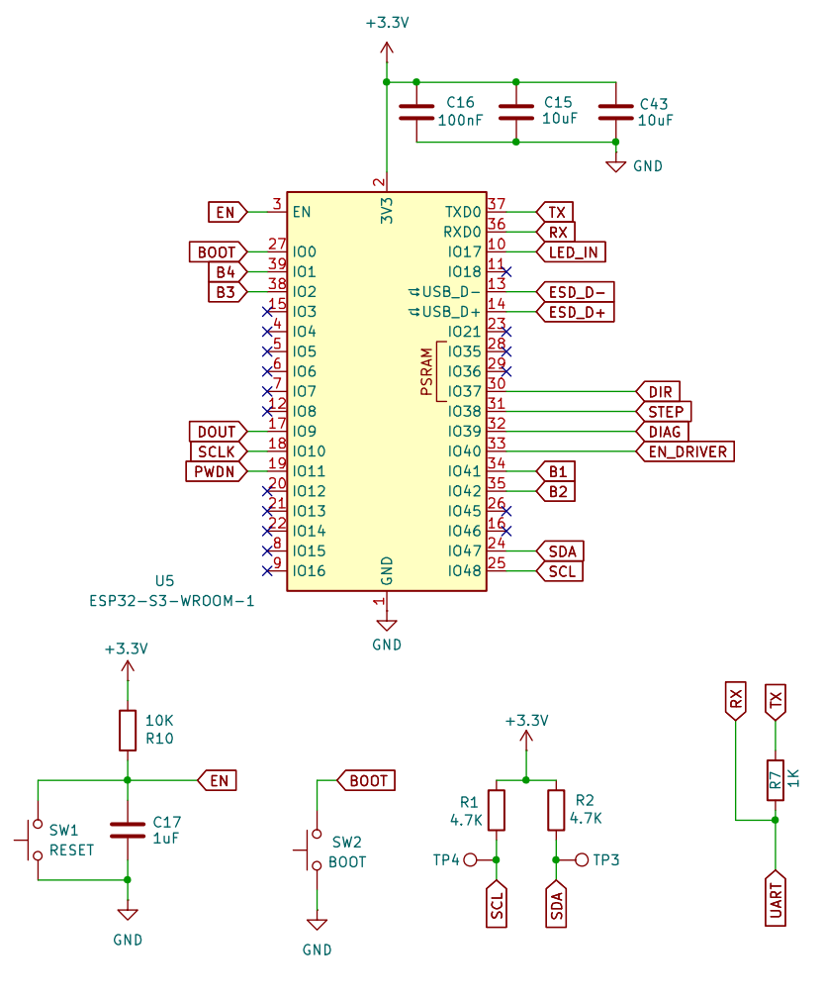

**ADS1232IPW — ADC da célula de carga.** Amplifica e digitaliza o sinal de força.

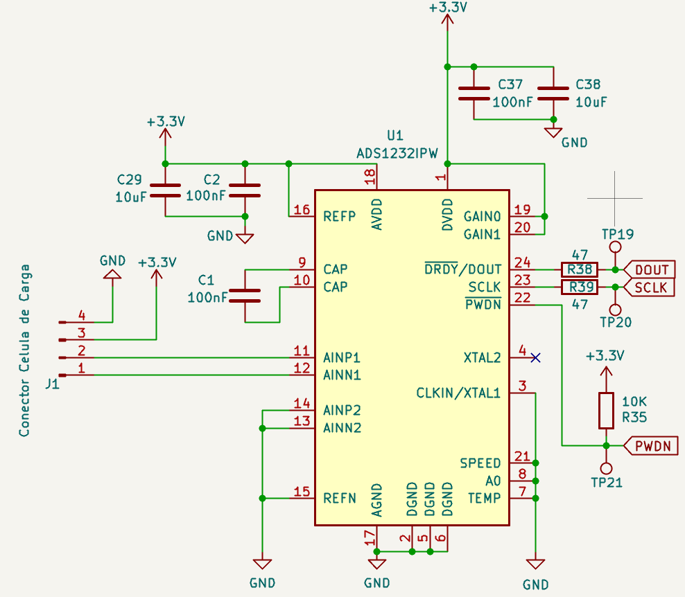

**TMC2209-LA — Driver do motor de passo.** Converte os comandos em corrente nas bobinas.

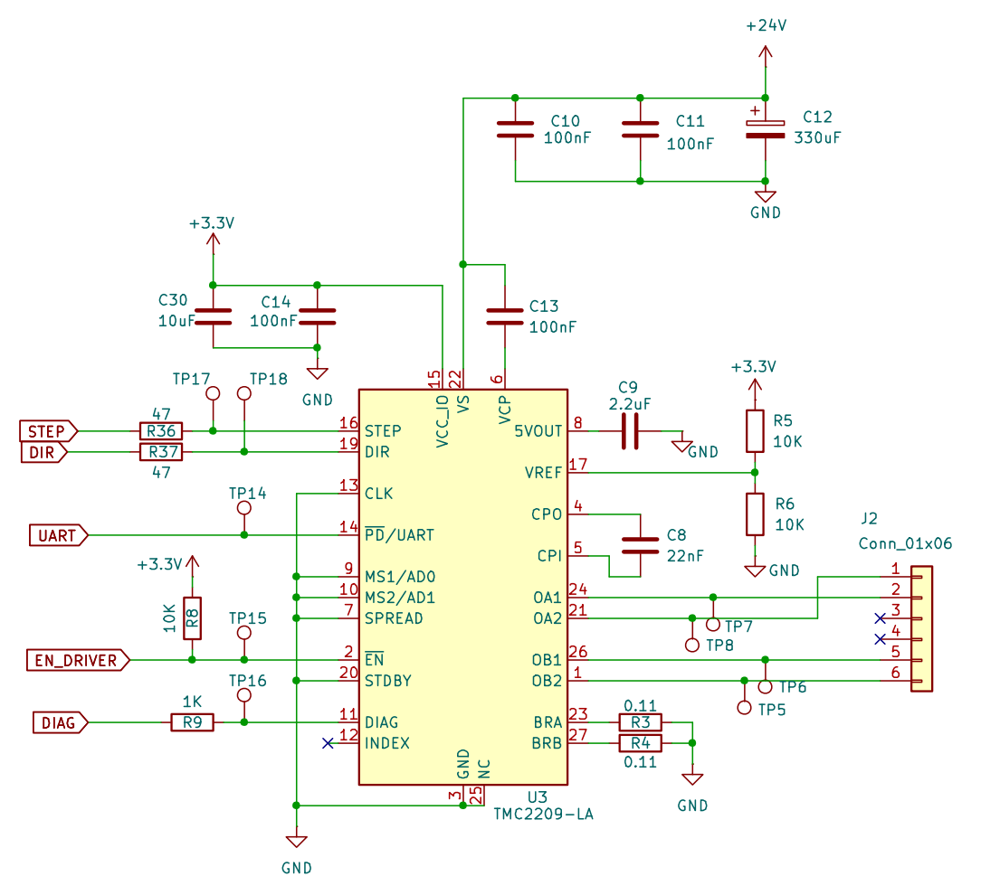

**BME280 — Sensor ambiental.** Mede a temperatura e a umidade do ensaio.

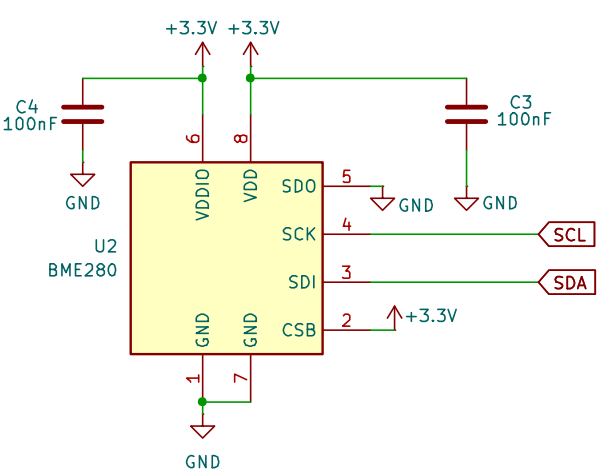

**INA226 — Monitor de 5 V.** Mede tensão, corrente e potência da linha de 5 V.

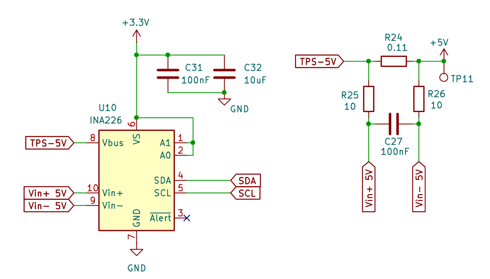

**INA226 — Monitor de 24 V.** Mede tensão, corrente e potência da linha de 24 V.

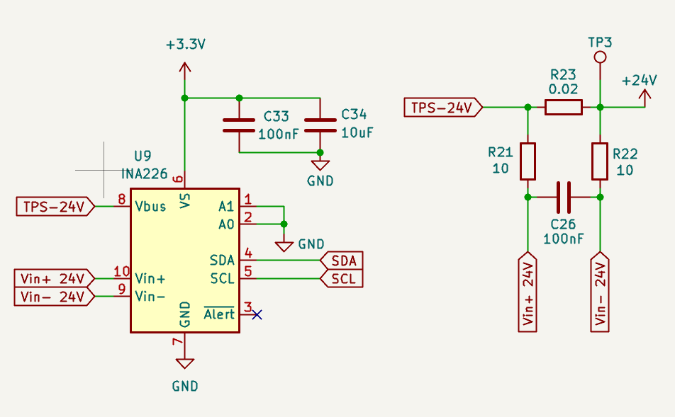

**TPS7A91 — Regulador 3,3 V.** Gera a tensão da parte digital e da excitação da célula.

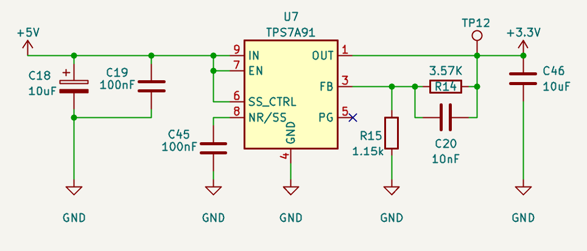

**TPS25210ARPWR — eFuse 5 V.** Protege a entrada USB contra sobretensão e sobrecorrente.

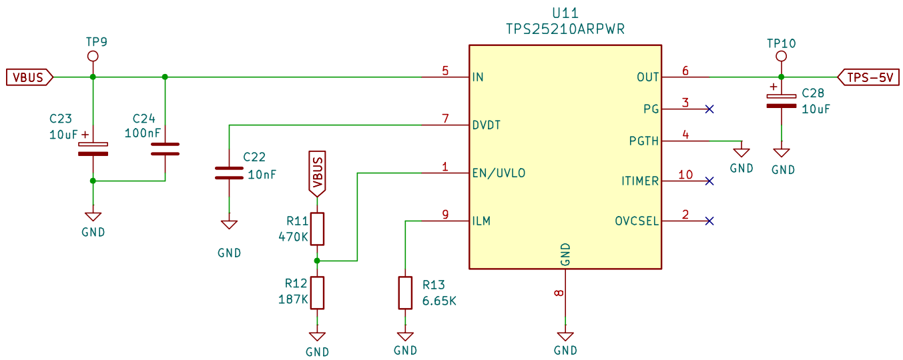

**TPS26630RGE — eFuse 24 V.** Protege a entrada da fonte externa.

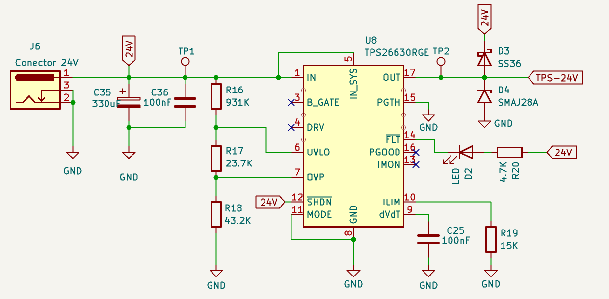

**USBLC6-2SC6 — Proteção ESD.** Desvia as descargas eletrostáticas do cabo USB.

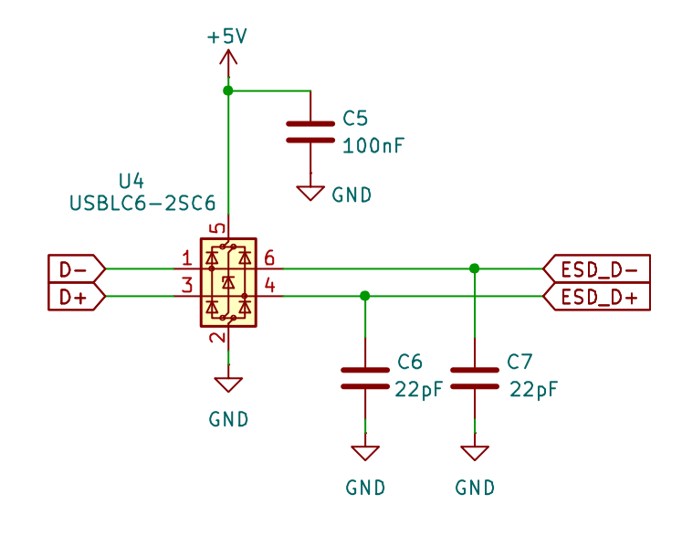

**WS2812D — LED indicador.** Sinaliza o estado do equipamento.

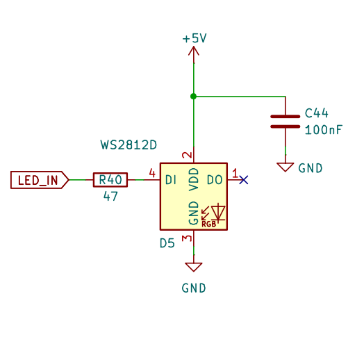

**Botões de ação.** Quatro entradas de comando do operador.

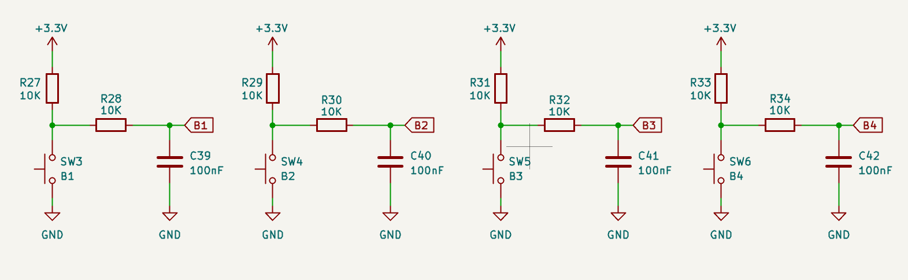

**Conector do display OLED.** Saída I2C para o display externo.

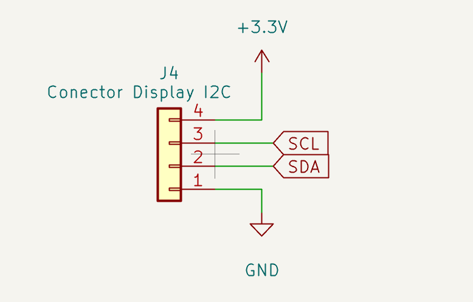

### Desenvolvimento 3D da estrutura de ensaio

[...]

## Referências

Norma **EN 13819-1:2020** via _BSI Standards Publication_: [EN 13819-1-2020 1.pdf](https://github.com/user-attachments/files/32043709/EN.13819-1-2020.1.pdf)
